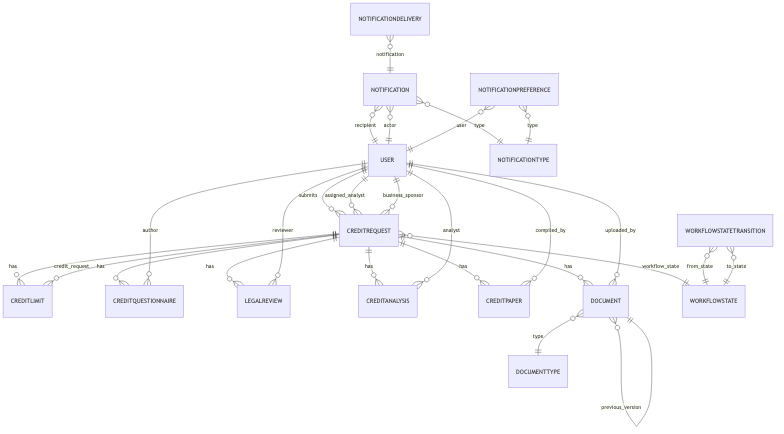
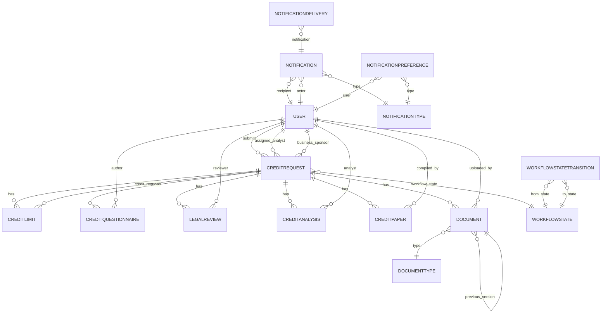

# Database Schema Overview

## Entity-Relationship Diagram (ERD)

### Mermaid ERD

## Key Models & Relationships

### User
- Standard Django user model, extended with roles.

### CreditRequest
- Represents a credit limit request.
- Fields: request_number, counterparty (FK), workflow_state (FK), submitter (FK), assigned_analyst (FK), business_sponsor (FK), priority, da_level, created_at, submitted_at, etc.

### CreditLimit
- Represents an individual credit limit (existing or proposed) associated with a CreditRequest.
- Fields:
    - credit_request (FK to CreditRequest)
    - limit_type (choices: Trading Pre-Settlement, Trading Settlement, Nostro Primary, Metal Lease, TRS, IM, VM, SBLC, RWA, NPL, MLRO, IOSCO, VAR, RWR, HWWR, Acceleration)
    - existing_limit_amount (decimal, nullable)
    - existing_tenor_months (integer, nullable)
    - proposed_limit_amount (decimal)
    - proposed_tenor_months (integer)
- A CreditRequest can have multiple related CreditLimit records (one per limit type requested).

### CreditQuestionnaire, LegalReview, CreditAnalysis, CreditPaper
- Linked to CreditRequest (FK), each supports draft/final status.
- Fields: author/reviewer/analyst/compiled_by (FK), is_draft, created_at, updated_at, etc.

### Document
- Linked to CreditRequest and DocumentType (FK).
- Fields: file, version, is_draft, uploaded_by (FK), previous_version (FK), description, pdf_file, created_at, updated_at.

### NotificationType, Notification, NotificationPreference, NotificationDelivery
- NotificationType: categorizes notifications.
- Notification: links to type, recipient (FK), actor (FK), message, url, read tracking.
- NotificationPreference: user-level notification settings.
- NotificationDelivery: delivery status, method, timestamp, error tracking.

### WorkflowState & WorkflowStateTransition
- Models workflow steps and allowed transitions.
- Fields: name, description, required_roles, etc.
- `state_id` (WorkflowState) is a unique string (max 8 chars).
- Transitions between states are defined in `WorkflowStateTransition` and require explicit allowed roles.

#### Transition API & Service Layer
- Transitions are triggered via the API endpoint `/api/credit-requests/{id}/transition/`.
- The API expects a valid `to_state_id` (primary key of WorkflowState) and `action_name`.
- The backend fetches the WorkflowState instance and passes it to the workflow engine service for validation and execution.
- Only users with a role matching `required_roles` in the transition may perform the action; otherwise, a 403 is returned.
- All transition assignments use WorkflowState instances, not raw IDs, to ensure data integrity.
- Tests must:
    - Provide unique, valid `state_id` values (≤8 chars).
    - Set up required transitions in the test DB before attempting transitions.
    - Assign users with appropriate roles for transition actions.

#### Error Handling
- Assigning an invalid or missing state will raise a validation error.
- Attempting a transition without a defined WorkflowStateTransition or with insufficient permissions will raise a 403 or validation error.

## Notes
- All FKs use `on_delete` for referential integrity.
- Timestamps for auditability.
- See models.py for full field details.
